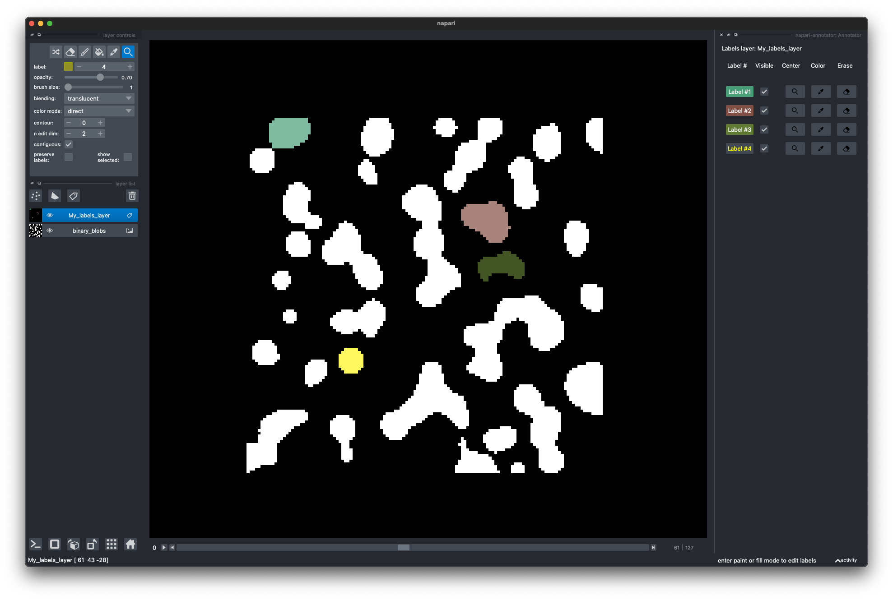

# napari-annotator

A lightweight plugin extending label layer control.

----------------------------------

This [napari] plugin was generated with [Cookiecutter] using [@napari]'s [cookiecutter-napari-plugin] template.

<!--
Don't miss the full getting started guide to set up your new package:
https://github.com/napari/cookiecutter-napari-plugin#getting-started

and review the napari docs for plugin developers:
https://napari.org/plugins/stable/index.html
-->
## Description
This lightweight plugin helps you navigate your labels layer. It is intended to ease your manual annotation work.

- Select a label from the list.
- Toggle the visibility of individual label entries.
- Move to the centroid of a label at the current zoom.
- Change the color of individual labels.
- Erase all drawn pixels of a given label.

## Usage
Start the plugin `Plugins > napari-annotator: Annotator`.

The plugin will list available labels once a labels layer is selected and labels drawn.

Color shuffling for labels will not work, since the plugin sets the color mode of the layer to `direct`.
But you can always change the color of individual labels, using the color picker.

## Known limitations
1. Lag when drawing (probably related to [this issue](https://github.com/napari/napari/issues/2380#issue-825308887)).
2. Erasing a label is not un-doable.
3. Locating / moving to the center of a label only works on 2D/3D label layers, i.e.:
   1. single- / multi-channel 2D label layers.
   2. single-channel 3D label layers (the third dimension being either Z or T).
4. Maximum 255 labels supported. Increasing number of supported label is possible, but when increasing it, colors in the canvas will mismatch the layer control and plugin entries (probably related to [this issue](https://github.com/napari/napari/issues/3174))
<!--This mismatch will also prevent the hide button to work on those mismatched labels...-->

### Note to self:
I am using a private object/methods for accessing napari icons (i.e. `_icons.get_icon_path('picker')`).
This is not amethod directly directly from the viewer or layer, but is it still OK?

## Installation

Not yet available via pip. Only from source.
<!--
You can install `napari-annotator` via [pip]:

    pip install napari-annotator

-->

To install latest development version :

    pip install git+https://github.com/loicsauteur/napari-annotator.git

## Contributing

Contributions are very welcome. Tests can be run with [tox], please ensure
the coverage at least stays the same before you submit a pull request.

## License

Distributed under the terms of the [BSD-3] license,
"napari-annotator" is free and open source software.

## Issues

If you encounter any problems, please [file an issue] along with a detailed description.
Or open a thread on [forum.image.sc](https://forum.image.sc) with a detailed description
and a [@loicsauteur](https://github.com/loicsauteur) tag.

[napari]: https://github.com/napari/napari
[Cookiecutter]: https://github.com/audreyr/cookiecutter
[@napari]: https://github.com/napari
[MIT]: http://opensource.org/licenses/MIT
[BSD-3]: http://opensource.org/licenses/BSD-3-Clause
[GNU GPL v3.0]: http://www.gnu.org/licenses/gpl-3.0.txt
[GNU LGPL v3.0]: http://www.gnu.org/licenses/lgpl-3.0.txt
[Apache Software License 2.0]: http://www.apache.org/licenses/LICENSE-2.0
[Mozilla Public License 2.0]: https://www.mozilla.org/media/MPL/2.0/index.txt
[cookiecutter-napari-plugin]: https://github.com/napari/cookiecutter-napari-plugin

[file an issue]: https://github.com/loicsauteur/napari-annotator/issues

[napari]: https://github.com/napari/napari
[tox]: https://tox.readthedocs.io/en/latest/
[pip]: https://pypi.org/project/pip/
[PyPI]: https://pypi.org/
